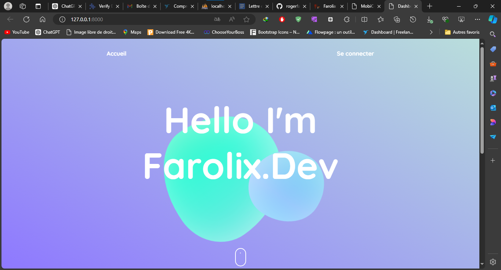
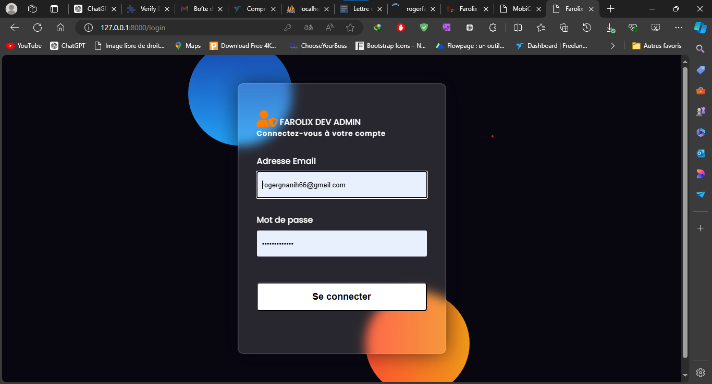
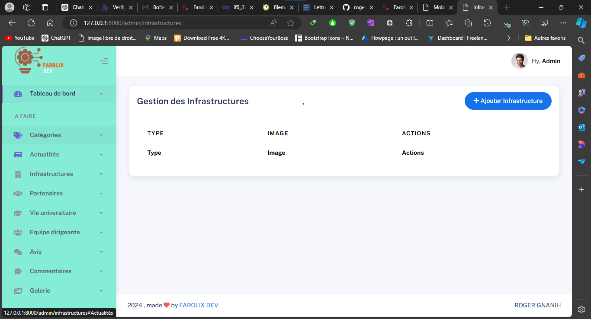
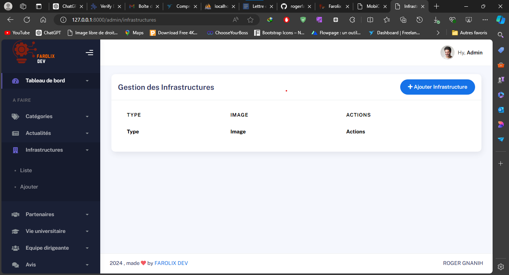

Dashboard Laravel

git clone

composer update

Créer un fichier .env
copier le contenu du fichier env.example dans .env

lier la base de donnée

php artisan migrate

php artisan db:seed

php artisan serve

pour les coordonnées, voir directement dans le seeder AdminSeeder

adresse mail : "admin@example.com"
Mot de passe : "password"

